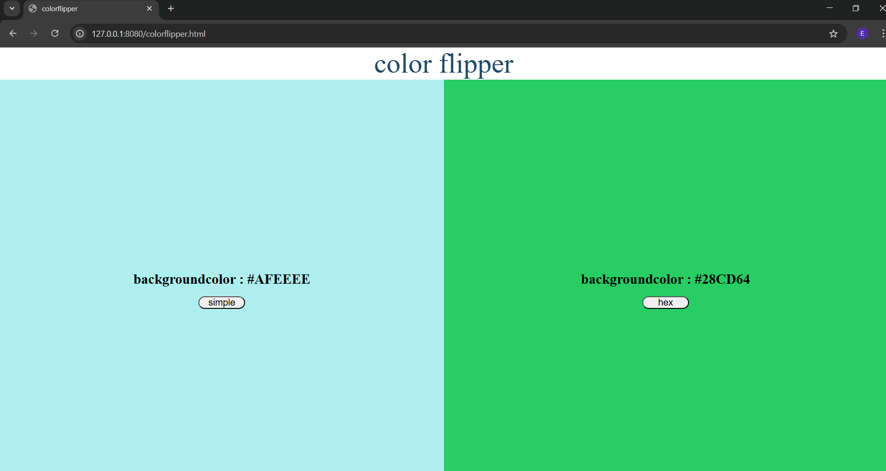

# 🎨 Color Flipper
- **Simple Colors Mode**: Selects a random color from a curated palette of predefined colors.
- **Hex Colors Mode**: Generates a fully random HEX color code for a more diverse color range.

## Screenshot

